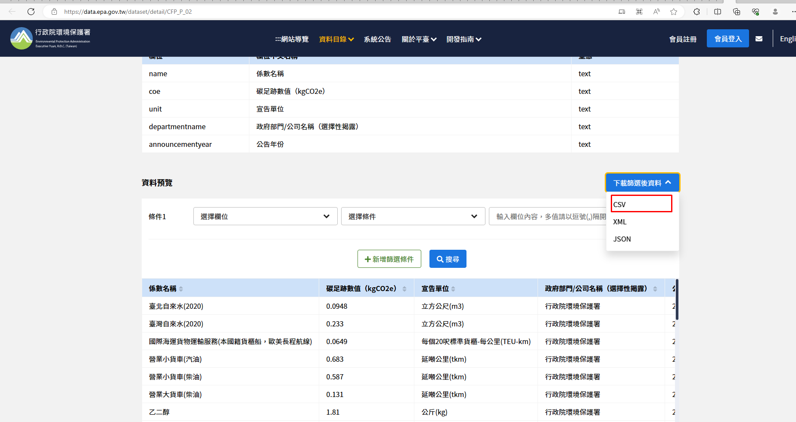
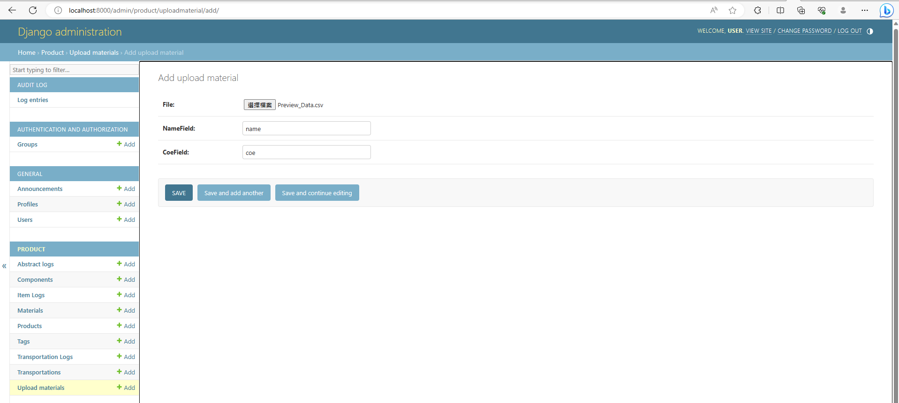
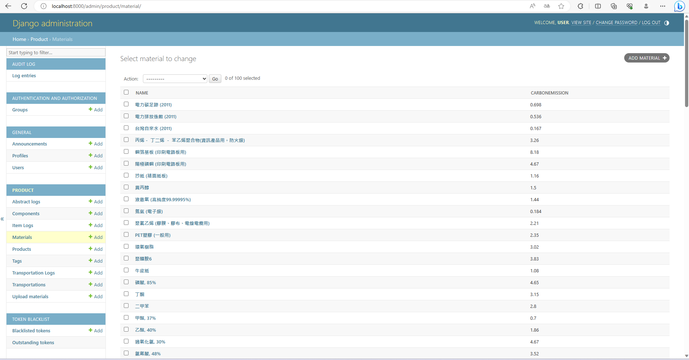
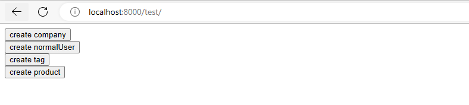

# Backend

## docs

/swagger or /redoc

## /user/logs

For normal user
Bearer token is required

## /user/products

For company user
Bearer token is required

## add materials with file

1. download csv file
2. create super user
`$ python manage.py createsuperuser`
3. go to django admin
`/admin`

4. done

## generate test data

`/test`

